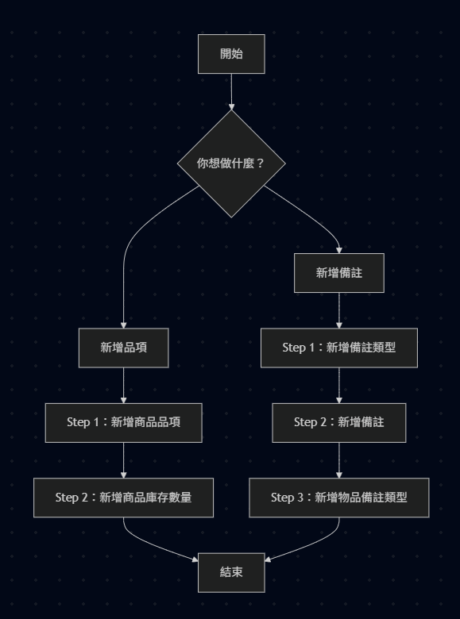
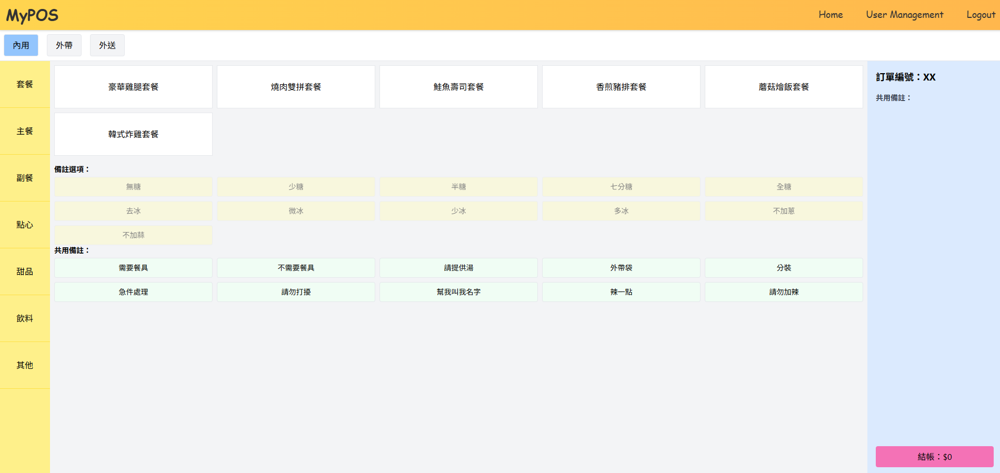
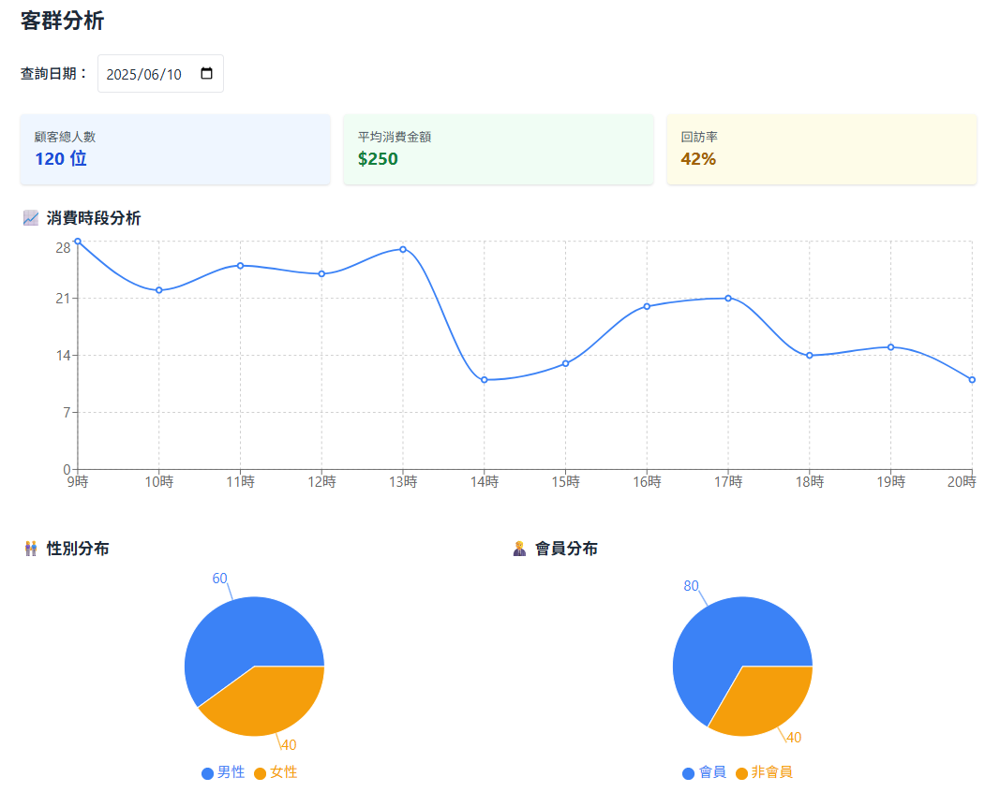
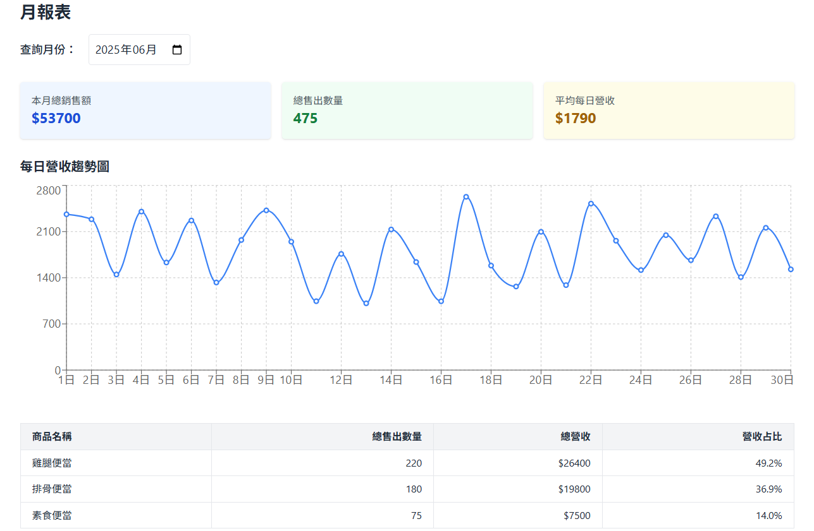

# MyPOS 點餐系統

MyPOS 是一套支援內用、外帶與外送的現代化 POS 點餐系統，採用 React + Node.js 全端架構，支援商品管理、訂單處理、報表統計、客群分析與行銷備註設定等功能，並提供顧客端操作介面，提升門市營運效率與顧客體驗。

## 【目錄索引】

- [🚀 安裝與執行方式](#安裝與執行方式)
- [🖥 系統架構與介面區分](#系統架構與介面區分)
- [📘 管理者功能總覽](#管理者功能總覽)
- [👤 使用者功能總覽](#使用者功能總覽)
- [📸 預覽畫面](#預覽畫面)
- [🧪 技術架構](#技術架構)
- [📄 授權 License](#授權-license)

---

## 【安裝與執行方式】

| 模式           | 指令                          | 說明                            |
|----------------|-------------------------------|---------------------------------|
| 安裝相依套件    | `pnpm install`                | 安裝全部套件                   |
| 全端執行       | `pnpm start`                  | 同時啟動前後端（Linux/macOS）  |
| 僅後端         | `pnpm backend-start`          | 僅啟動 Node.js 後端服務        |
| 僅前端         | `pnpm frontend-start`         | 僅啟動 React 前端應用程式      |
| Windows 全端   | `pnpm start:windows`          | Windows 平台同時啟動前後端     |
| Windows 後端   | `pnpm backend-start:windows`  | Windows 平台後端服務           |
| Windows 前端   | `pnpm frontend-start`         | Windows 平台前端應用程式       |

## 【系統架構與介面區分】

| 角色         | 功能介面                         | 登入方式            | 權限說明                                       |
|--------------|----------------------------------|---------------------|------------------------------------------------|
| 👑 管理員     | Dashboard（後台管理系統）         | 帳號密碼登入         | 擁有全部權限，含系統設定、權限管理、帳號建立等 |
| 👩‍💼 店員       | Dashboard（後台管理系統）         | 帳號密碼登入         | 可進行結帳、報表、商品與訂單管理               |
| 🧑‍🍳 顧客 | User Pages（用戶操作介面）         | 帳號密碼登入           | 下單、查詢訂單與註冊身份                         |

## 【管理者功能總覽】

### 🏪 門市作業

- **結帳 Checkout**  
  進行顧客結帳作業，支援商品選取、數量調整、備註與加購功能，系統自動計算總金額。

- **庫存管理 Inventory**  
  管理商品存貨，包括新增、修改品項庫存量，並可查看即時庫存狀態。

---

### 📊 報表作業

- **交班表 ShiftReport**  
  紀錄並顯示班別交接資料，包括營業時段與金額。

- **日報表 DailyReport**  
  每日營收統計報表，包含銷售總額、訂單筆數。

- **月報表 MonthlyReport**  
  長期經營數據彙整，輔助決策與營運優化。

---

### 📈 經營分析

- **銷售排行 SalesRanking**  
  顯示熱銷商品排行榜，依照銷售數量與營收排名。

- **客群分析 CustomerAnalysis**  
  分析顧客類型、消費頻率與金額分佈，協助精準行銷。

- **備註分析 NoteAnalysis**  
  統計熱門備註（如少冰、去蔥等）使用情況，供菜單與流程優化參考。

---

### 🗂️ 系統管理

- **商品管理 ProductItemForm**  
  編輯商品資料，設定名稱、類別、備註。

- **訂單管理 OrderManagement**  
  查詢歷史訂單。

- **備註管理 NoteManagement**  
  管理自訂備註分類，可設定不同類別與狀態。

- **用戶管理 UserManagement**  
  管理後台使用者帳號、角色與登入資訊。

- **權限設定 PermissionSetting**  
  控制各使用者角色的可用功能（如僅允許查看報表或編輯商品）。

- **系統設定 SystemSetting**  
  設定系統參數（稅率、幣別、營業資訊等）。

## 【使用者功能總覽】
- **首頁 UserHome**  
  使用者起始畫面，顯示功能與入口。

- **下單頁 UserOrder**  
  商品選購頁，支援數量選擇、加購、備註與立即結帳。

- **送出結果 UserOrderSubmit**  
  訂單送出結果頁面，顯示訂單狀態與預計時間。

- **歷史訂單 UserOrderHistory**  
  可查詢歷史訂單與消費紀錄。

- **使用者註冊 UserRegister**  
  提供基本資料填寫，註冊用戶身份。

- **404 NotFound**  
  任何錯誤頁面，導向至此。

## 【功能流程圖】

## 【預覽畫面】

## 【技術架構】

- **前端**：React + TypeScript + TailwindCSS
- **後端**：Express.js
- **資料庫**：SQLite 
- **套件管理**：pnpm

## 【授權 License】

本專案採用 MIT License 授權。可自由使用、修改與發布，但需保留原作者資訊。
